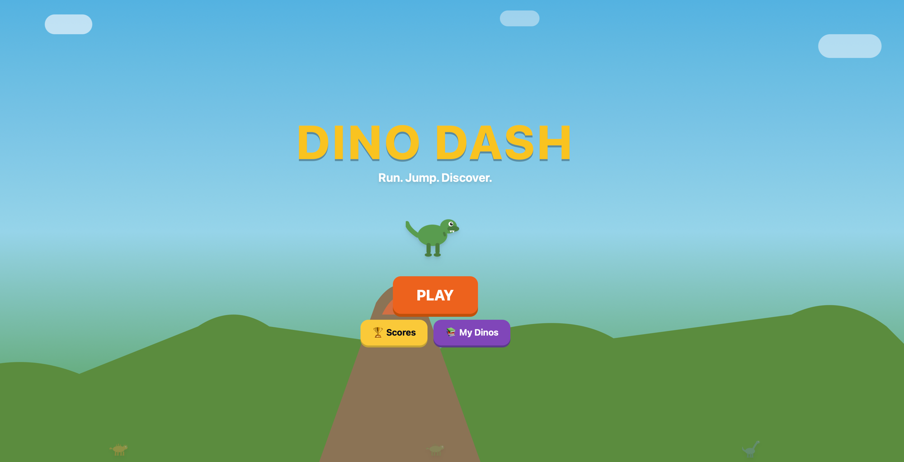

# Dino Dash

> **Work in progress.** A father-son project — my 4-year-old is obsessed with dinosaurs, so we're building him a game. Learning together, shipping as we go.

An educational endless runner for kids. Collect fossils, discover dinosaur facts, chase your high score.



## Why

My son loves dinosaurs. Most dino games are either mindless or boring. Dino Dash makes the learning the reward — you collect fossils to build your score, and rare fact eggs teach you real dinosaur science. The game design borrows from Chrome Dino, Sonic, and Crossy Road: one input, tight feedback, instant restart.

## How it plays

**One mechanic:** tap to jump. Hold for a higher jump. That's it.

**Three things happen:**

1. **Fossils** spawn constantly in jump arcs. Collect them for points. Each consecutive pickup plays an ascending musical note (C→D→E→G→A→C). Miss the timing window and the scale resets. Kids jump just to hear the music.

2. **Obstacles** (rocks, logs) end your run. You have 3 hearts. Get hit → lose a heart and half your fossils scatter outward (Sonic ring system). Scramble to re-collect before they fade. 0 hearts = game over.

3. **Fact eggs** appear twice per run. Golden, glowing, rare. Worth 100 points. Each one teaches a real dinosaur fact — diet, size, era, or fun quirk. The fact flashes as a banner while the game continues.

Game over → tap → playing again in 0.3 seconds. No menus, no friction.

## Features

- **10 playable dinosaurs** with unique SVG art (biped, quadruped, flyer, longneck)
- **40 dinosaur facts** across diet, size, era, and fun categories
- **Ascending pentatonic pickups** — fossil collection creates musical phrases via Web Audio synthesis
- **Sonic-style hit system** — fossils scatter on damage, recoverable for 1.5 seconds
- **Streak multiplier** — 5+ consecutive fossils = x2, 10+ = x3 with screen edge glow
- **Parallax background** — 6-layer CSS animation with background events (shooting stars, volcano puffs, distant herds)
- **Leaderboard** with procedurally generated avatar dinos (random colors, hats, bowties)
- **Read-aloud facts** on the results screen via Web Speech API
- **Near-miss feedback** — barely clear an obstacle and get a "CLOSE!" flash
- **Squash and stretch** on every jump and landing
- **Screen shake** on hits
- **12 achievements** tracking lifetime stats

## Install

```sh
git clone https://github.com/stanleyraywood/dino-discovery-play.git
cd dino-discovery-play
npm install
npm run dev
```

Opens at `http://localhost:8080`. Works on desktop and mobile (tap to jump, touch anywhere).

To build: `npm run build`

Requires Node 18+.

## Architecture

React 18 + Vite + Tailwind. Zero game engine. Zero audio files.

```
src/
  components/game/
    RunnerGame.tsx      Game loop, physics, spawning, collision, rendering
    DinoSVG.tsx         4 body types as parametric SVG
    AvatarDino.tsx      Procedural avatar generation (random colors + hats + accessories)
    ParallaxBackground  6-layer CSS-animated scrolling background
    Particles.tsx       DOM-based particle system (~50 particles max)
    WelcomeScreen       Title, play, leaderboard
    LeaderboardScreen   Top 10 with avatar dinos
    CollectionScreen    Dino encyclopedia with fact progress
    ScreenTransition    Fade/scale transitions between screens
  hooks/
    useGamePhysics      Variable jump height, coyote time, jump buffering, squash/stretch
    useGameInput        Keyboard + touch input with per-frame polling
    useGameLoop         requestAnimationFrame with delta time capping
    useScreenShake      Decaying sinusoidal shake
  lib/
    physics.ts          Tuning constants (speed, gravity, intervals, streak thresholds)
    audio.ts            Web Audio API synthesis — all sounds generated from oscillators
  data/
    dinosaurs.ts        10 dinos, 40 facts, localStorage persistence
    leaderboard.ts      Top 10 scores, avatar generation
    achievements.ts     12 achievements with stat tracking
```

### Physics

Variable jump height: hold = floaty rise (gravity 0.45), release = fast fall (gravity 1.6). Coyote time gives 6 frames of grace after leaving ground. Jump buffering remembers presses 6 frames before landing.

Squash and stretch is frame-rate independent: recovery speed scales by `dt / 16.67`.

### Audio

Every sound is synthesized at runtime using `OscillatorNode` + `GainNode` envelopes. No audio files, no loading, no licensing.

| Sound | Technique |
|-------|-----------|
| Fossil collect | Pentatonic scale: `[523, 587, 659, 784, 880, 1047]` Hz indexed by streak position |
| Jump | Triangle wave 220→580 Hz sweep, 120ms |
| Obstacle hit | Noise burst + sine 300→100 Hz drop |
| Egg collect | Square wave two-tone (988 Hz → 1319 Hz) — Mario coin homage |
| Near miss | Sine 400→800 Hz, 150ms |
| Victory | C-E-G-C ascending sawtooth arpeggio |
| Game over | A-F#-E-C descending sine |
| Read-aloud | `SpeechSynthesisUtterance`, rate 0.85, pitch 1.1 |

### Persistence

| Data | Storage | Key |
|------|---------|-----|
| Unlocked dinos | localStorage | `dino-unlocked` |
| Collected facts | localStorage | `dino-facts` |
| High score | localStorage | `dino-dash-best` |
| Leaderboard | localStorage | `dino-dash-leaderboard` |
| Player stats | localStorage | `dino-player-stats` |
| Achievements | localStorage | `dino-achievements` |
| Mute preference | localStorage | `dino-muted` |

## Design decisions

**Web Audio, not audio files.** All sounds synthesized from oscillators. Zero load time, zero licensing, ~50 lines of code. The ascending pentatonic fossil pickup is the single most important feature — it turns collection into music.

**DOM particles, not canvas.** Particle count stays under 50. CSS animations handle the heavy lifting. No canvas context, no WebGL, no complexity.

**CSS animation for parallax.** Each background layer uses `animation: parallax-scroll Xs linear infinite` with a `width: 200%` container that translates to `-50%`. No JavaScript modulo arithmetic, no seam snapping.

**Hearts over timer.** The game originally ended on a 35-second timer. Now it ends when you run out of hearts (or the 40s timer, whichever first). Hearts create stakes. Timer creates a ceiling. Together they create the "one more try" feeling.

**Fossils over distance.** The score was originally distance-based. Now it's fossil-based with streak multipliers. This makes the game about collecting, not surviving. The fossils ARE the game — placed in arcs that teach you to jump.

**Instant restart.** Game over → tap → playing in < 300ms. No results screen, no menus. The friction to quit is higher than the friction to retry. This is Flappy Bird's insight.

**Facts as rare treasure.** Originally 4 fact eggs spawned every 2.8 seconds. Now exactly 2 spawn per run at fixed times (15s, 30s). Scarcity creates excitement. The learning happens at the natural pause — after a run, on the results screen, where each fact has a read-aloud button.

## Licence

MIT
